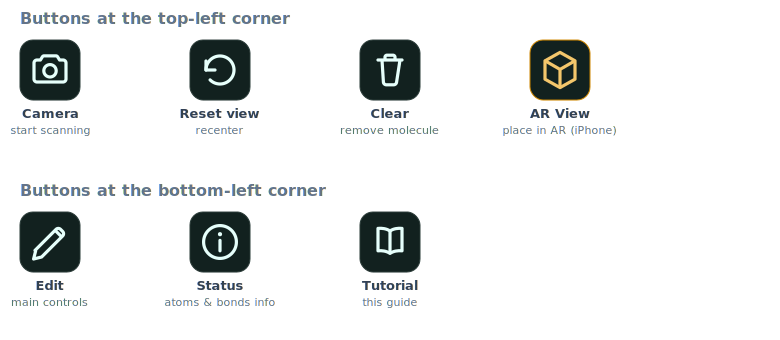
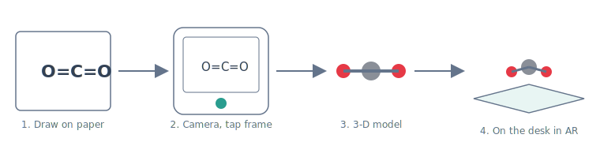
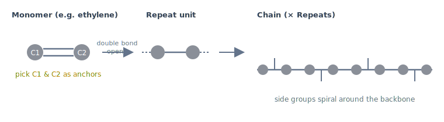

# Polymer AR Lab

**Draw a molecule on paper, and watch it pop into 3-D — even in augmented reality on your desk.** You can also look up real molecules, snap them together into long polymer chains, and save a file that lets scientists' software "relax" the shape. It all runs in your web browser on a **phone or a computer** — nothing to download.

### ▶️ Open it here

- **App:** https://kenichinomura.github.io/PolymerARLab/
- **Illustrated guide:** https://kenichinomura.github.io/PolymerARLab/tutorial.html

> 📱 On a **phone**, you scan drawings with the camera. 🖥️ On a **computer**, you upload a photo instead. Both work the same after that.

---

## What can it do?

1. 📷 **Scan a hand-drawn Lewis structure** — take a photo of your drawing and get a 3-D molecule.
2. 🧬 **Build a polymer chain** — take one small molecule and repeat it into a long chain.
3. 🔎 **Look up real molecules** — type a name like *caffeine* and download its real 3-D shape (from PubChem).
4. 💾 **Save a science file** — export a file that the simulation program **LAMMPS** can open to tidy up the shape.
5. 🥽 **Augmented reality** — stand the molecule up on your real desk through the camera.

---

## The buttons

- **Camera** — turns on the camera to scan a drawing. Once it's on, **tap the frame on the screen to take the picture** (drag the frame's edges to make it bigger or smaller, drag the middle to move it).
- **Reset view** — recenters the molecule if it drifts off screen.
- **Clear** — removes the molecule so you can start over.
- **AR View** — (on iPhone/iPad) places the molecule in the real world.
- **Edit** ✏️ — opens the molecule panel (scan a sketch, look up molecules, toggle labels).
- **Polymer** 🔗 — opens the polymer builder (choose a curing mechanism, load monomers, grow a chain).
- **Status** ⓘ — shows how many atoms and bonds the molecule has.
- **Tutorial** 📖 — opens the picture guide.
- **Save** ⬇ — downloads the LAMMPS files for the current structure.

---

## Guide 1 — Scan a drawing and see it in AR

1. **Draw** a molecule on paper — clear lines and letters work best (try water, CO₂, or ethanol).
2. **Take the picture.**
   - 📱 **Phone:** tap **Camera**, line the drawing up inside the on-screen frame, then **tap the frame**.
   - 🖥️ **Computer:** tap **Edit → Upload sketch** and pick a photo.
   - A flash and a spinning "Recognizing…" circle appear, then your 3-D molecule shows up.
3. **Look around** — drag to spin it, scroll or pinch to zoom. In **Edit** you can turn on **Atom labels** (C1, C2, …) and **Show hydrogens**.
4. **See it in AR** — put the molecule on your real desk:
   - 📱 **iPhone/iPad:** tap the **AR View** button, wait until it glows, tap again, then point at your paper.
   - 🤖 **Android:** tap **START AR** (top-right), point at your desk, and tap the screen — the molecule appears on that spot.

*(AR needs a back camera and a secure page. If your device can't do AR, you can still spin the molecule in 3-D.)*

---

## Guide 2 — Build a polymer and save it for LAMMPS

1. **Open the polymer builder.** Tap the **Polymer** 🔗 icon in the bottom-left dock and choose how your polymer cures: **Addition cure** (opens a C=C double bond) or **Condensation cure** (each new bond releases one H₂O). The screen clears so you start fresh.
2. **Load a monomer.** Type a name in the panel's **PubChem** box — try `ethylene` or `styrene` for addition — and press **Load**. Atom labels turn on automatically so every atom shows its name (C1, C2, …).
3. **Pick the two anchor atoms** — where the chain will connect (for a vinyl monomer, the two carbons of the double bond) — and press **Make repeat unit**. The molecule copies itself into a chain.
4. Drag the **Repeats** slider to make the chain longer or shorter.

**Condensation polymers (they release water!):** some real polymers — polyesters like PET, nylons, proteins — form by *condensation*: every new bond squeezes out one H₂O molecule. To try it:

1. In the polymer builder, choose **Condensation cure** and load a monomer with the right ends, e.g. `lactic acid`.
2. The app suggests the −COOH carbon and the −OH oxygen as anchors (you can re-pick them; a wrong pick shows an error explaining what can react).
3. Press **Make repeat unit** — the chain forms and little **water molecules float away from every new bond**. The Status panel counts them (`releases n−1 H2O`).
4. For polymers made from **two different monomers**: load the first (try `ethylene glycol`) into slot **A** and pick its two −OH oxygens. Tap slot **B** and load the second (`terephthalic acid`) — **both molecules appear on screen**, labelled **A** and **B**. Pick B's two −COOH carbons and press **Make repeat unit (combine A + B)** — that's **PET**, the plastic in drink bottles. (`hexamethylenediamine` + `adipic acid` makes **nylon 6,6**.)
5. Press the **Save LAMMPS (UFF)** download icon in the bottom-left dock. It downloads two files: `<name>.data` (the molecule) and `in.relax` (the instructions).
6. If you use the science program **LAMMPS**, run `lmp -in in.relax`. It gently tidies the shape and saves the movie of it moving (`.min.xyz`, `.nvt.xyz`) and the final shape (`.relaxed.data`).

> 💡 Keep **Show hydrogens** turned on before you save, so the file has every atom.

---

## Tips

- **Draw clearly** with good lighting — the scanner is making its best guess. Tap the **Status** ⓘ button to see what it found, and redraw if it looks wrong.
- **Reset view** just recenters the camera; **Clear** removes the molecule completely.
- Some molecules use elements the app doesn't support — if a lookup fails, try a simpler molecule.

---

*Are you a teacher or developer who wants to run, host, or change the app?
See the [Developer guide](DEVELOPMENT.md).*
