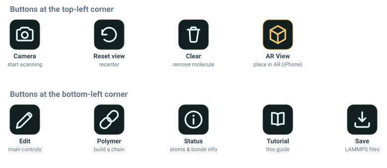
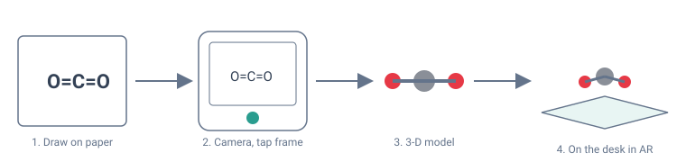
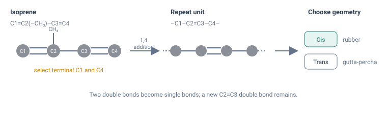

# Polymer AR Lab

**Draw a molecule on paper, and watch it pop into 3-D — even in augmented reality on your desk.** You can also look up real molecules, snap them together into long polymer chains, and save a file that lets scientists' software "relax" the shape. It all runs in your web browser on a **phone or a computer** — nothing to download.

> **For education only:** Polymer AR Lab is a teaching demonstration. Molecular recognition, generated structures, UFF-style parameters, and simulation schedules are approximate. The app is not validated for production engineering, safety decisions, or research conclusions.

### ▶️ Open it here

- **App:** https://kenichinomura.github.io/PolymerARLab/
- **Illustrated guide:** https://kenichinomura.github.io/PolymerARLab/tutorial.html

> 📱 On a **phone**, you scan drawings with the camera. 🖥️ On a **computer**, you upload a photo instead. Both work the same after that.

---

## What can it do?

1. 📷 **Scan a hand-drawn Lewis structure** — take a photo of your drawing and get a 3-D molecule.
2. 🧬 **Build a polymer chain** — take one small molecule and repeat it into a long chain.
3. 🔎 **Load real molecules** — type a name like *caffeine*, a PubChem CID, or a SMILES string such as `CC(=O)O`.
4. 💾 **Save a science file** — export a file that the simulation program **LAMMPS** can open to tidy up the shape.
5. 🥽 **Augmented reality** — stand the molecule up on your real desk through the camera.

---

## The buttons

- **Camera** — turns on the camera to scan a drawing. Once it's on, **tap the frame on the screen to take the picture** (drag the frame's edges to make it bigger or smaller, drag the middle to move it).
- **Reset view** — recenters the molecule if it drifts off screen.
- **Clear** — removes the molecule so you can start over.
- **AR View** — (on iPhone/iPad) places the molecule in the real world.
- **Edit** ✏️ — opens the molecule panel (load PubChem/SMILES, upload a sketch, toggle labels).
- **Polymer** 🔗 — opens the polymer builder (choose a curing mechanism, load monomers, grow a chain).
- **Status** ⓘ — shows how many atoms and bonds the molecule has.
- **Tutorial** 📖 — opens the picture guide.
- **Save** ⬇ — downloads the LAMMPS files for the current structure.

---

## Guide 1 — Scan a drawing and see it in AR

1. **Draw** a molecule on paper — clear lines and letters work best (try water, CO₂, or ethanol).
2. **Take the picture.**
   - 📱 **Phone:** tap **Camera**, line the drawing up inside the on-screen frame, then **tap the frame**.
   - 🖥️ **Computer:** tap **Edit → Upload sketch** and pick a photo.
   - A flash and a spinning "Recognizing…" circle appear, then your 3-D molecule shows up.
3. **Look around** — drag to spin it, scroll or pinch to zoom. In **Edit** you can turn on **Atom labels** (C1, C2, …) and **Show hydrogens**.
4. **See it in AR** — put the molecule on your real desk:
   - 📱 **iPhone/iPad:** tap the **AR View** button, wait until it glows, tap again, then point at your paper.
   - 🤖 **Android:** tap **START AR** (top-right), point at your desk, and tap the screen — the molecule appears on that spot.

*(AR needs a back camera and a secure page. If your device can't do AR, you can still spin the molecule in 3-D.)*

---

## Guide 2 — Build a polymer and save it for LAMMPS

1. **Open the polymer builder.** Tap the **Polymer** 🔗 icon and choose **Addition cure** or **Condensation cure**. Edit and Polymer cannot be open together; changing panels clears the previous working scene.
2. **Choose the input source.** Tap the database icon for a PubChem name/CID or the smile icon for SMILES, enter the molecule, and press **Load**. PubChem is selected by default. SMILES is case-sensitive: uppercase `C` is aliphatic carbon and lowercase `c` is aromatic carbon.
3. **Try isoprene 1,4-addition.** In SMILES mode, load `C=C(C=C)C` (an ordering that keeps the diene backbone labelled C1–C4), select terminal atoms C1 and C4, and choose **Cis** or **Trans**. The two original double bonds become single bonds and a new C2=C3 double bond remains: `C1=C2–C3=C4` → `–C1–C2=C3–C4–`.
4. Press **Make repeat unit**, then drag the **Repeats** slider. If you change Cis/Trans after building, the app returns to the monomer; press **Make repeat unit** again to build the newly selected geometry.

**Cis and trans polyisoprene:** cis-1,4-polyisoprene models natural rubber, while trans-1,4-polyisoprene models gutta-percha. The cis chain generally crystallizes less readily when unstretched; the trans chain packs and crystallizes more readily. Natural rubber can still crystallize under strain or suitable low-temperature conditions, so it is not correct to say that cis-polyisoprene never crystallizes.

**Condensation polymers:** the app uses a simplified teaching model in which forming a new bond releases H₂O from a carboxylic acid or HCl from an acyl chloride. To try it:

1. In the polymer builder, choose **Condensation cure** and load a monomer with the right ends, e.g. `lactic acid`.
2. The app suggests the −COOH carbon and the −OH oxygen as anchors (you can re-pick them; a wrong pick shows an error explaining what can react).
3. Press **Make repeat unit** — the chain forms and little byproduct molecules float away. They are a teaching visual and are excluded from AR and LAMMPS exports.
4. For **PET**, load `ethylene glycol` into slot **A** and pick its two alcohol oxygens. Load `terephthalic acid` into slot **B** and pick its two carboxyl carbons. The new ester bonds form between those oxygens and carbons. In the simplified net reaction, the alcohol oxygen remains in the ester linkage; the acid −OH and alcohol H form water. Industrial PET production is more involved: initial direct esterification forms water, while later melt polycondensation commonly removes ethylene glycol.
5. Press the **Save LAMMPS (UFF)** download icon in the bottom-left dock. It downloads two files: `<name>.data` (the molecule) and `in.relax` (the instructions).
6. If you use **LAMMPS**, run `lmp -in in.relax`. It performs overlap relief, FIRE minimization, and 10 ps of NVT at 300 K, then saves one XYZ trajectory (`.xyz`) and the final shape (`.relaxed.data`). This short, finite-chain vacuum run demonstrates geometry relaxation; it cannot establish bulk crystallinity or research-quality material properties.

> 💡 Keep **Show hydrogens** turned on before you save, so the file has every atom.

---

## Tips

- **Draw clearly** with good lighting — the scanner is making its best guess. Tap the **Status** ⓘ button to see what it found, and redraw if it looks wrong.
- **Reset view** just recenters the camera; **Clear** removes the molecule completely.
- Some molecules use elements the app doesn't support — if a lookup fails, try a simpler molecule.

---

*Are you a teacher or developer who wants to run, host, or change the app?
See the [Developer guide](DEVELOPMENT.md).*
